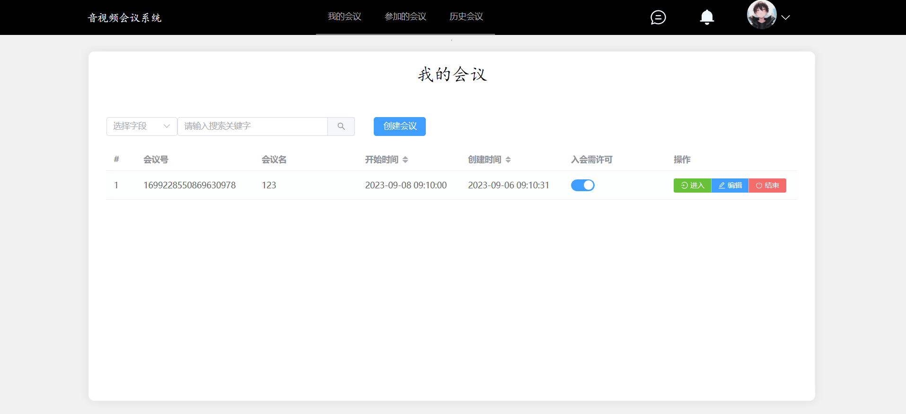
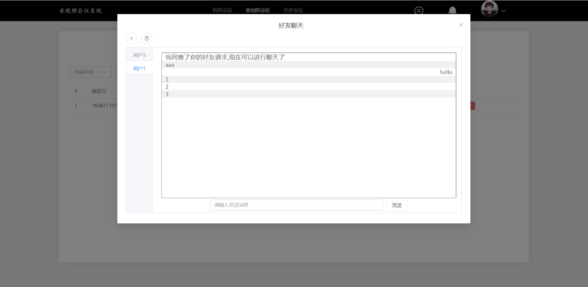
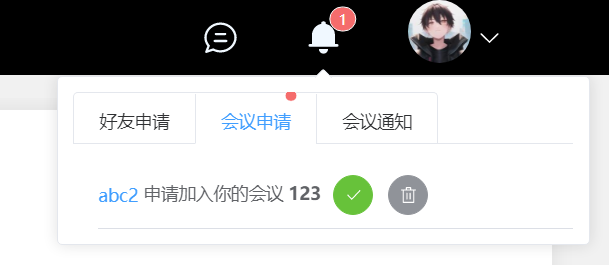
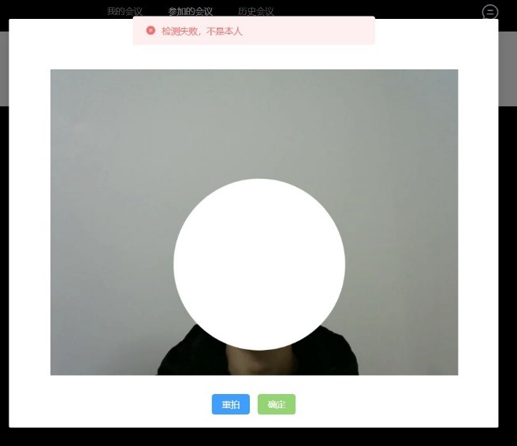
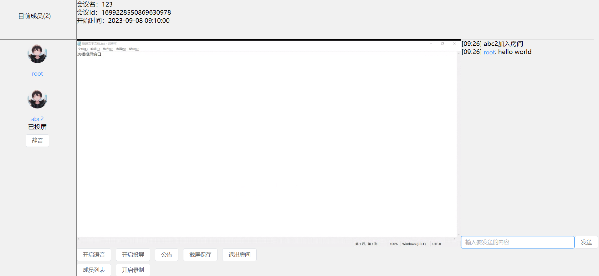
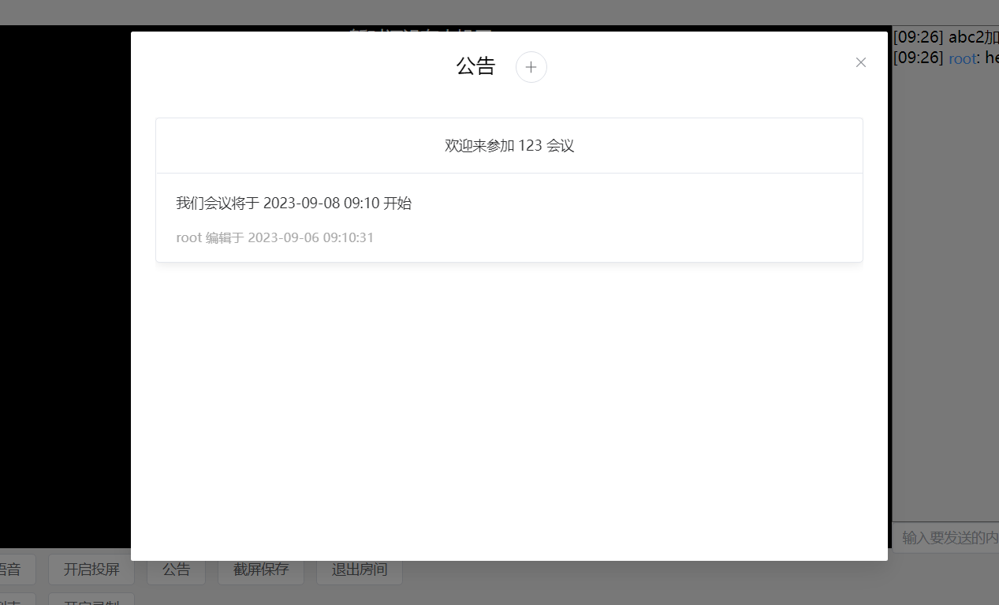
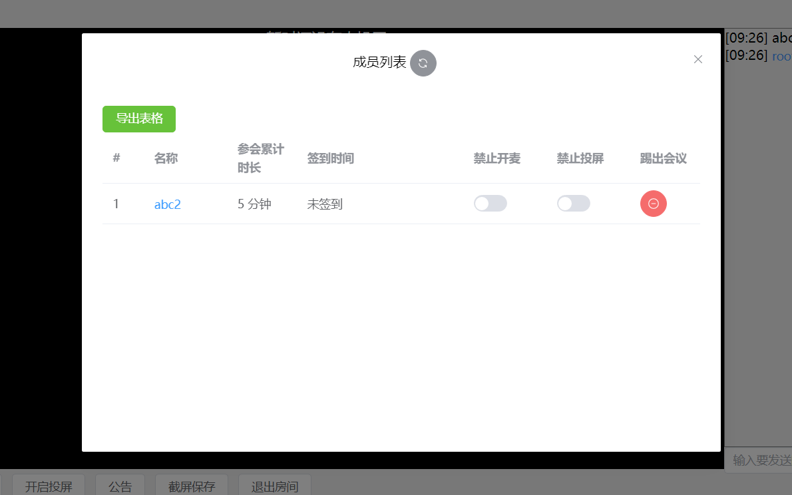
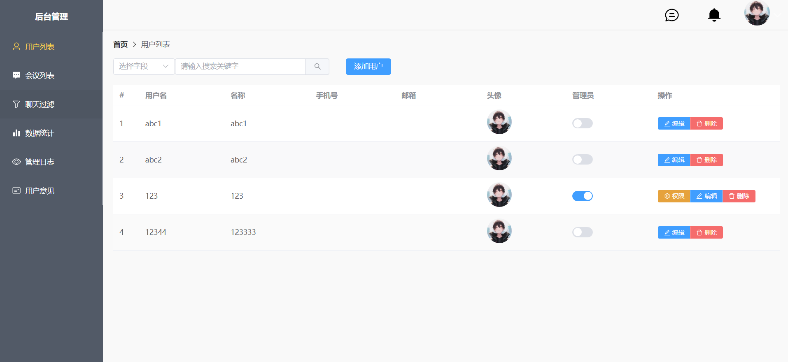

## meeting_system_front

后端：https://github.com/xyongfeng/meeting_system_backend

AI端：https://github.com/xyongfeng/meeting_system_ai

### 项目功能介绍

#### 用户前台

**注册/登录**

**会议管理模块**：我的会议、参加的会议、历史会议

**会议房间模块**：开启语音或者投屏、发送消息、查看会议公告、截屏、管理成员权限，录制屏幕（本地录制）

**好友模块**：与好友进行消息发送，没有通话功能

接收通知（好友与会议公告通知）、上传个人照片（人脸识别）、意见反馈

#### 管理后台

用户与权限管理、会议管理、聊天词过滤、数据统计（会议时间分布、消息词云图）、管理日志（记录管理员请求）、用户反馈意见查看

### 开发环境

node.js 16

### 安装依赖

npm install

### 运行

npm run dev

**第一次打开项目会出现白屏，卡顿等现象**

### root登录

用户名密码都是root，无法直接修改，修改只能通过数据库

### 配置文件 

**src/config.js** 进行项目请求地址相关配置

### 预览图

**简单展示本项目主要功能及页面**

进入会议房间，进行检测，以下是检测失败结果，检测成功则会进入会议

 

